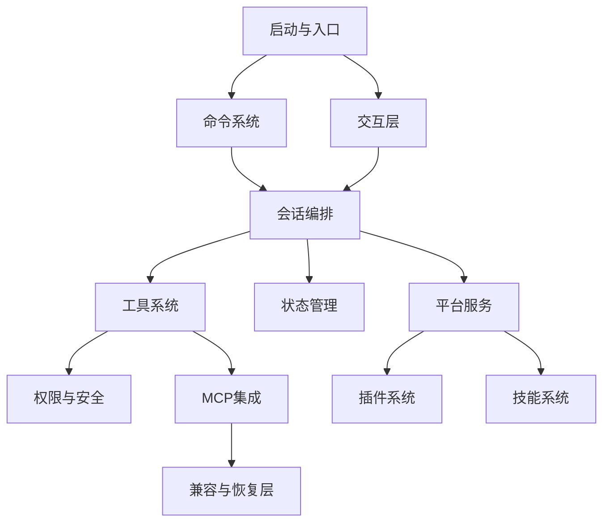

# Claude Code Rev 模块设计文档总览

## 使用方式

这是一套面向学习的“按模块拆分”设计文档。建议按编号顺序阅读：

1. 先看启动与入口，理解系统如何被拉起；
2. 再看命令、交互、会话编排，掌握主链路；
3. 然后看工具、权限、MCP、插件、技能，理解能力扩展；
4. 最后看状态、平台服务、兼容层，建立工程治理视角。

---

## 文档目录

### 快速导航（可点击）

- [01 启动与入口模块设计](./01-启动与入口模块设计.md)：理解项目如何从进程参数进入主流程。  
- [02 命令系统模块设计](./02-命令系统模块设计.md)：理解用户意图如何转成命令执行上下文。  
- [03 交互层模块设计](./03-交互层模块设计.md)：理解 REPL/UI 如何组织输入输出与状态展示。  
- [04 会话编排模块设计](./04-会话编排模块设计.md)：理解 QueryEngine 如何驱动多轮闭环。  
- [05 工具系统模块设计](./05-工具系统模块设计.md)：理解工具注册、过滤、合并与调用治理。  
- [06 权限与安全模块设计](./06-权限与安全模块设计.md)：理解允许/拒绝/确认的安全决策链。  
- [07 MCP 集成模块设计](./07-MCP集成模块设计.md)：理解外部能力接入、认证与协议治理。  
- [08 插件系统模块设计](./08-插件系统模块设计.md)：理解插件生命周期与扩展注入机制。  
- [09 技能系统模块设计](./09-技能系统模块设计.md)：理解技能如何增强命令与工具使用效果。  
- [10 状态管理模块设计](./10-状态管理模块设计.md)：理解全局状态分层与一致性保障。  
- [11 平台服务模块设计](./11-平台服务模块设计.md)：理解 API/策略/遥测等横切能力。  
- [12 兼容与恢复模块设计](./12-兼容与恢复模块设计.md)：理解 shim/vendor 在恢复工程中的角色。  

### 推荐阅读顺序（含预计时长）

| 顺序 | 文档 | 预计时长 |
|---|---|---|
| 1 | [01 启动与入口](./01-启动与入口模块设计.md) | 25~35 分钟 |
| 2 | [02 命令系统](./02-命令系统模块设计.md) + [03 交互层](./03-交互层模块设计.md) | 40~55 分钟 |
| 3 | [04 会话编排](./04-会话编排模块设计.md) | 35~50 分钟 |
| 4 | [05 工具系统](./05-工具系统模块设计.md) + [06 权限安全](./06-权限与安全模块设计.md) | 45~60 分钟 |
| 5 | [07 MCP 集成](./07-MCP集成模块设计.md) + [08 插件系统](./08-插件系统模块设计.md) + [09 技能系统](./09-技能系统模块设计.md) | 60~80 分钟 |
| 6 | [10 状态管理](./10-状态管理模块设计.md) + [11 平台服务](./11-平台服务模块设计.md) + [12 兼容恢复](./12-兼容与恢复模块设计.md) | 60~80 分钟 |

---

## 统一阅读框架（每篇都可按此学习）

- **模块定位**：它在全系统中的角色与边界
- **职责与接口**：输入、输出、依赖对象
- **内部分层**：子模块如何协作
- **关键流程**：主时序与异常分支
- **数据与状态**：关键状态对象与更新方式
- **风险与治理**：复杂度来源与改进方向
- **学习练习**：建议的代码走读与动手任务

---

## 全局关系图

