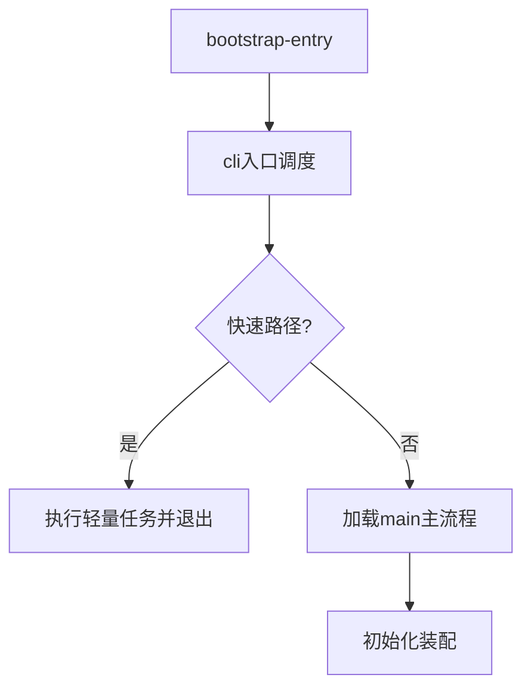

# 启动与入口模块设计

## 1. 模块定位

启动与入口模块负责把“进程级输入”转化为“系统级运行态”，是全项目的第一跳调度层。

主要覆盖：

- `src/bootstrap-entry.ts`
- `src/entrypoints/cli.tsx`
- `src/main.tsx`（入口装配段）

---

## 2. 职责边界

**负责**

- 构建最小运行环境（宏、基础错误处理、关键环境变量）
- 参数识别与路径分流（快速路径/完整路径）
- 触发主流程加载并移交控制权

**不负责**

- 业务命令实现细节
- 工具执行与会话编排细节

---

## 3. 设计目标

- 启动快：非主路径尽量避免重模块加载
- 边界清：入口只做调度，不做深业务
- 可观测：关键启动阶段可打点、可定位

---

## 4. 架构分层

---

## 5. 关键流程

## 5.1 启动主流程

1. 初始化构建期宏与输出错误处理；
2. 读取 `argv`，识别版本、daemon、bridge、后台会话等快捷路径；
3. 命中快捷路径则直接执行并结束；
4. 未命中则进入完整流程，加载主模块；
5. 主模块完成配置、认证、能力装配后进入交互/非交互会话。

## 5.2 快速路径设计价值

- 缩短冷启动耗时；
- 减少内存占用峰值；
- 将“命令工具化”与“系统初始化”解耦。

---

## 6. 输入输出模型

- **输入**：进程参数、环境变量、运行环境（本地/远程）
- **输出**：
  - 快速路径下的即时结果（版本、子命令结果等）
  - 完整路径下的主流程控制权与初始化上下文

---

## 7. 关键风险与治理

- **入口膨胀风险**：分支不断增加导致可维护性下降  
  建议：建立分流注册表，按类别拆文件

- **行为不一致风险**：快速路径与完整路径配置不一致  
  建议：抽取共享初始化最小集

- **错误定位困难**：早期阶段报错上下文不足  
  建议：增加启动阶段结构化日志标签

---

## 8. 学习建议

- 练习 1：画出所有入口参数的分流树
- 练习 2：标记每个分支的“最小依赖集合”
- 练习 3：总结哪些初始化必须前置，哪些可延迟

