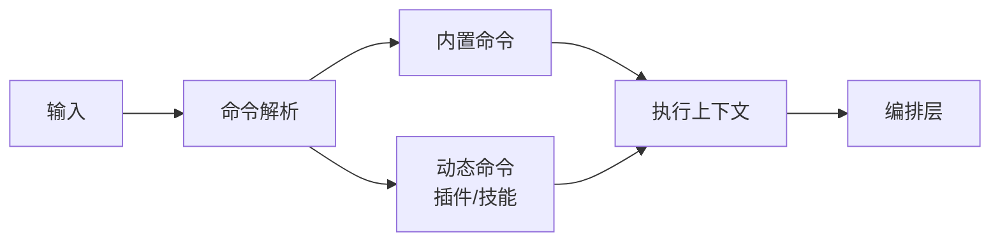

# 命令系统模块设计

## 1. 模块定位

命令系统是用户意图的语义入口，把自然输入或命令输入映射为可执行动作。

主要覆盖：

- `src/commands.ts`
- `src/commands/*`

---

## 2. 职责边界

**负责**

- 注册内置命令与动态命令
- 决定命令启用条件（环境、特性、模式）
- 将命令转换为执行上下文并交给编排层

**不负责**

- 模型对话编排
- 具体工具执行

---

## 3. 命令分层模型

---

## 4. 核心设计

## 4.1 注册机制

- 采用“集中注册 + 条件加载”策略；
- 命令按功能域分目录组织；
- 特性开关用于控制命令暴露面。

## 4.2 执行抽象

- 命令定义统一结构（名称、描述、输入、执行方式）；
- 命令处理与会话编排解耦；
- 允许命令在交互态与非交互态复用。

---

## 5. 关键流程

1. 解析用户输入是否命令；
2. 匹配命令注册表；
3. 校验可用性（环境、权限、模式）；
4. 生成命令执行上下文；
5. 进入编排层执行并回传结果。

---

## 6. 扩展机制

- 插件可注入命令；
- 技能可注入命令或命令增强；
- 条件门控保证命令生态可控扩展。

---

## 7. 关键风险与治理

- **命令可发现性下降**：命令过多难以学习  
  建议：按核心/高级/实验分类展示

- **启用条件复杂**：多开关叠加影响预期  
  建议：维护命令启用矩阵文档

- **动态命令质量不齐**  
  建议：建立命令扩展准入规范

---

## 8. 学习建议

- 练习 1：选择 3 个命令画调用链
- 练习 2：写出命令生命周期（发现 -> 解析 -> 执行 -> 回写）
- 练习 3：尝试设计一个新命令的定义草案

