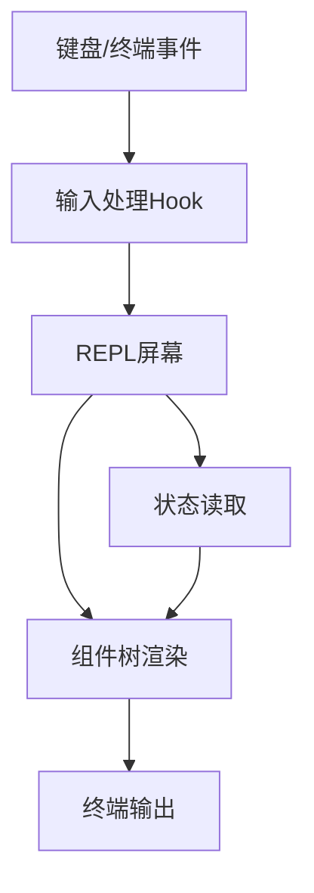

# 交互层模块设计

## 1. 模块定位

交互层负责终端 UI 展示与输入事件组织，是用户体验与系统能力之间的桥。

主要覆盖：

- `src/screens/REPL.tsx`
- `src/components/*`
- `src/ink/*`
- `src/hooks/*`（交互相关）

---

## 2. 职责边界

**负责**

- 渲染消息、状态、输入区、任务区等界面
- 收集并规范化用户输入事件
- 展示编排层回传的中间态与结果态

**不负责**

- 业务逻辑决策
- 工具执行策略

---

## 3. 交互架构

---

## 4. 关键设计点

## 4.1 React + Ink 终端 UI

- 采用组件化方式组织界面区域；
- UI 与状态驱动同步，强调可预测更新；
- 通过自定义 Ink 能力支持复杂终端交互。

## 4.2 交互状态管理

- 输入焦点、选择态、弹窗态、任务态分离；
- 展示态与业务态通过 AppState 协调；
- 保持交互响应与长任务反馈可视化。

---

## 5. 关键流程

1. 用户触发输入事件；
2. 输入处理层规范化为操作意图；
3. 交互层提交给编排层；
4. 编排层回传消息、状态、工具结果；
5. 交互层增量渲染并保持可继续输入。

---

## 6. 体验设计关注点

- 长任务可感知（loading、进度、任务状态）
- 错误可读可恢复（信息明确、下一步建议）
- 会话连续性（上下文不丢、回看友好）

---

## 7. 风险与治理

- **组件复杂度攀升**：单屏逻辑过重  
  建议：按场景拆分容器组件与展示组件

- **状态耦合过深**  
  建议：约束状态读写边界，减少跨层直接依赖

- **交互回归难**  
  建议：定义关键交互路径清单进行手工回归

---

## 8. 学习建议

- 练习 1：绘制 REPL 页面主要区域与数据来源
- 练习 2：追踪一次输入提交流经哪些 Hook/组件
- 练习 3：总结交互层与编排层的接口契约

