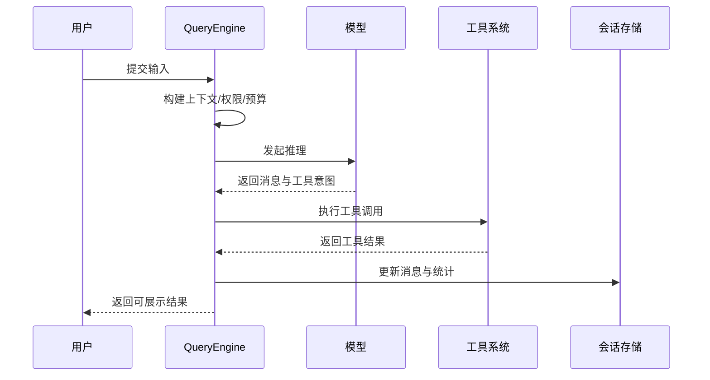

# 会话编排模块设计

## 1. 模块定位

会话编排模块是系统核心中枢，负责把“输入、模型、工具、状态、输出”组织成稳定闭环。

主要覆盖：

- `src/QueryEngine.ts`
- `src/query.ts`
- `src/utils/processUserInput/*`
- `src/utils/queryContext.ts`

---

## 2. 职责边界

**负责**

- 多轮会话状态维护
- 单轮执行流程编排
- 工具调用与结果整合
- 错误分类、重试、持久化

**不负责**

- 终端界面渲染
- 具体工具内部实现

---

## 3. 编排闭环

---

## 4. 关键设计

## 4.1 单轮（Turn）模型

- 一次输入触发一次 turn；
- turn 内可能包含多次工具调用；
- turn 结束后统一回写状态与统计。

## 4.2 多轮会话状态

- 消息历史持续累积；
- 权限拒绝与预算消耗可跨轮传递；
- 关键状态支持持久化恢复。

## 4.3 异常控制

- 可中断机制避免长任务失控；
- 可恢复异常优先走重试/降级；
- 不可恢复异常给出清晰反馈并收尾。

---

## 5. 状态与数据

- 输入消息与系统上下文
- 工具调用记录与结果消息
- token/成本/耗时等统计信息
- 权限决策轨迹与拒绝原因

---

## 6. 与其他模块关系

- 上游接收命令与交互输入；
- 下游驱动工具系统和平台服务；
- 横向读取状态管理并写回会话存储。

---

## 7. 风险与治理

- **编排器过重风险**  
  建议：拆分策略层（重试、预算、压缩）与主流程层

- **状态一致性风险**  
  建议：定义状态转移图与关键不变量

- **异常路径不可测风险**  
  建议：维护异常场景矩阵（权限、网络、外部服务）

---

## 8. 学习建议

- 练习 1：画出一轮 turn 的状态流图
- 练习 2：分别追踪成功路径与失败路径
- 练习 3：梳理“哪些状态是 turn 内临时态，哪些是会话持久态”

