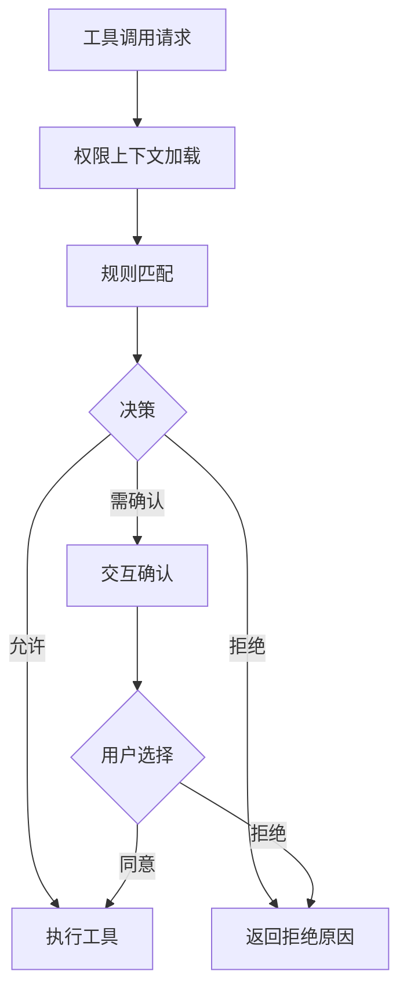

# 权限与安全模块设计

## 1. 模块定位

权限与安全模块负责控制“哪些操作可以执行、如何执行、何时拒绝”，是系统可信运行的护栏。

主要覆盖：

- `src/utils/permissions/*`
- `src/hooks/toolPermission/*`
- 工具调用中的权限上下文

---

## 2. 职责边界

**负责**

- 权限模式定义与解析
- 工具执行前决策（允许/拒绝/交互确认）
- 权限拒绝原因记录与用户反馈

**不负责**

- 工具具体业务逻辑
- UI 组件细节渲染

---

## 3. 安全决策流程

---

## 4. 关键设计

## 4.1 权限模式分层

- 默认模式：平衡效率与安全；
- 自动模式：依赖规则和分类器能力；
- 严格模式：更多确认、最小授权。

## 4.2 决策上下文

- 工具类型与输入参数；
- 当前会话状态与角色身份；
- 环境与策略限制（组织策略、运行模式）。

## 4.3 安全反馈闭环

- 拒绝必须可解释；
- 允许必须可追踪；
- 交互确认必须可复盘。

---

## 5. 风险与治理

- **误放行风险**  
  建议：高风险工具默认更严格策略

- **过度拦截风险**  
  建议：按场景优化规则，减少误拒绝

- **策略复杂度风险**  
  建议：规则分层（全局/项目/会话）并做冲突检查

---

## 6. 学习建议

- 练习 1：梳理一个工具调用从请求到决策的完整路径
- 练习 2：模拟高风险工具权限策略设计
- 练习 3：整理“拒绝原因词典”并映射用户可读文案

