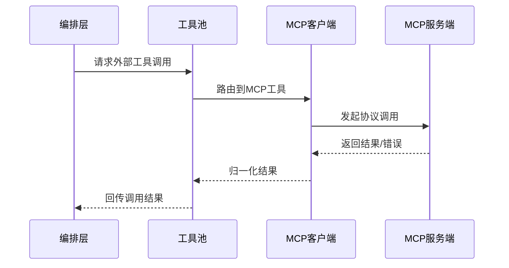

# MCP 集成模块设计

## 1. 模块定位

MCP 集成模块是系统对接外部能力的统一协议层，使工具系统可以调用外部服务并读取外部资源。

主要覆盖：

- `src/services/mcp/*`
- `src/tools/MCPTool/*`
- `src/tools/ListMcpResourcesTool/*`
- `src/tools/ReadMcpResourceTool/*`

---

## 2. 职责边界

**负责**

- 管理 MCP 客户端连接与生命周期
- 发现并注册 MCP 工具/资源/命令
- 调用 MCP 工具并处理协议级错误
- 处理认证与会话失效恢复

**不负责**

- 业务层命令逻辑
- 本地内置工具逻辑

---

## 3. 连接与调用流程

---

## 4. 关键设计

## 4.1 多传输支持

- 支持 stdio、SSE、HTTP、WebSocket 等传输；
- 连接策略按 server 配置动态选择。

## 4.2 认证与会话治理

- 支持 token 刷新与鉴权失败恢复；
- 会话过期要有识别与重连策略。

## 4.3 输出治理

- 对大结果进行裁剪与持久化；
- 错误信息做协议归一化，便于编排层处理。

---

## 5. 风险与治理

- **外部依赖波动**：导致整体体验抖动  
  建议：按 server 维度设置超时、重试、熔断

- **协议兼容风险**  
  建议：建立统一适配层屏蔽差异

- **安全边界风险**  
  建议：MCP 能力纳入统一权限策略

---

## 6. 学习建议

- 练习 1：梳理一个 MCP 工具从注册到调用的全链路
- 练习 2：总结 3 类常见 MCP 错误及处理策略
- 练习 3：设计 MCP 接入验收清单（连通性/性能/安全）

