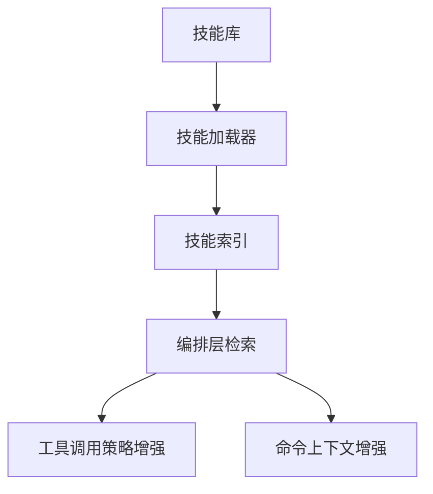

# 技能系统模块设计

## 1. 模块定位

技能系统用于组织任务知识与能力提示，帮助模型在不同场景下更快进入正确执行模式。

主要覆盖：

- `src/skills/*`
- 技能加载与技能命令关联逻辑

---

## 2. 职责边界

**负责**

- 管理内置技能与外部技能来源
- 组织技能元数据与检索入口
- 将技能能力接入命令/工具使用上下文

**不负责**

- 工具执行细节
- UI 渲染实现

---

## 3. 技能协同模型

---

## 4. 关键设计

## 4.1 技能来源

- 内置技能：项目内随版本分发；
- 扩展技能：可来自外部源或 MCP 相关能力。

## 4.2 使用方式

- 显式触发：用户主动选择技能；
- 隐式触发：编排层按场景自动关联技能。

## 4.3 缓存与刷新

- 技能索引可缓存以提升检索效率；
- 配置变更后需要增量刷新机制。

---

## 5. 风险与治理

- **技能质量不稳定**  
  建议：建立技能模板与质量评分标准

- **技能冗余冲突**  
  建议：做能力标签化和去重治理

- **提示膨胀风险**  
  建议：按场景最小化注入技能上下文

---

## 6. 学习建议

- 练习 1：梳理技能从加载到使用的路径
- 练习 2：总结技能如何影响工具选择
- 练习 3：设计一个场景化技能卡片模板

