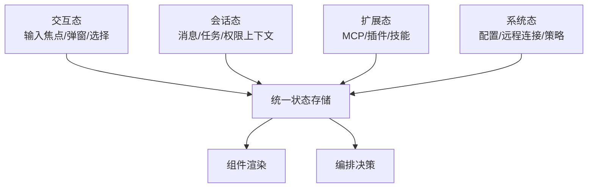

# 状态管理模块设计

## 1. 模块定位

状态管理模块是全系统一致性基础，负责维护交互态、会话态、扩展态和系统态。

主要覆盖：

- `src/state/*`
- `src/context/*`
- `src/hooks/*`（状态联动相关）

---

## 2. 职责边界

**负责**

- 应用全局状态结构定义
- 状态变更与订阅机制
- 模块间状态协同（UI、编排、MCP、插件等）

**不负责**

- 业务计算本身
- 外部服务调用细节

---

## 3. 状态分层模型

---

## 4. 关键设计

## 4.1 轻量 Store 策略

- 使用轻量自定义状态管理；
- 强调类型约束与可预测更新；
- 降低外部状态框架耦合。

## 4.2 状态边界

- UI 态与业务态分层；
- 会话态支持跨轮次持续；
- 扩展态支持动态更新与重连。

## 4.3 一致性要求

- 关键状态更新应原子化；
- 异常路径避免半更新状态；
- 状态写入要有来源可追踪。

---

## 5. 风险与治理

- **状态结构膨胀**  
  建议：按域拆分子状态并建立边界约束

- **跨模块直接写状态**  
  建议：统一状态更新入口，减少隐式副作用

- **并发更新冲突**  
  建议：关键状态引入版本号或事务语义

---

## 6. 学习建议

- 练习 1：梳理 AppState 的域划分
- 练习 2：追踪一次用户输入引发的状态变化链
- 练习 3：总结哪些状态应持久化，哪些只应内存存在

