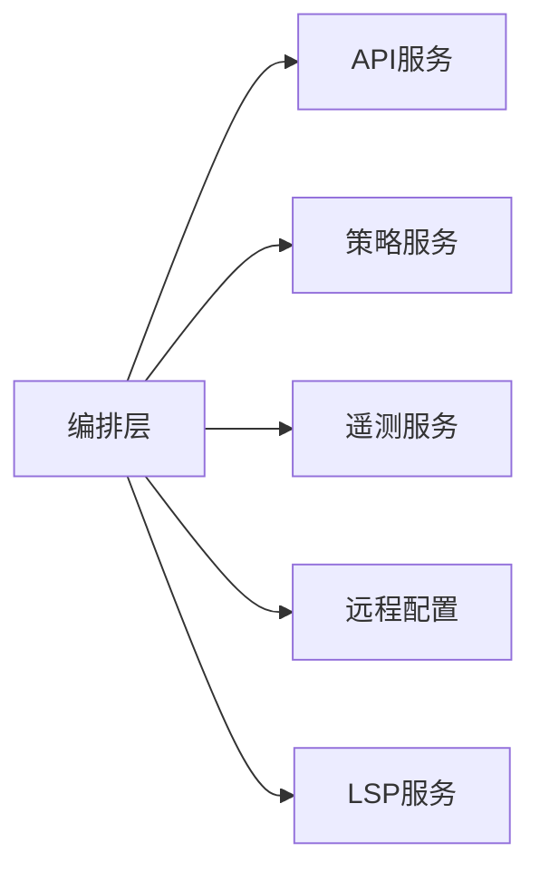

# 平台服务模块设计

## 1. 模块定位

平台服务模块提供横切能力，支撑主流程在认证、策略、观测、远程配置等方面稳定运行。

主要覆盖：

- `src/services/api/*`
- `src/services/analytics/*`
- `src/services/policyLimits/*`
- `src/services/remoteManagedSettings/*`
- `src/services/lsp/*`

---

## 2. 职责边界

**负责**

- 提供 API 接口封装与调用治理
- 提供遥测、日志、指标能力
- 提供策略限制与远程配置能力
- 提供 LSP 等开发辅助能力

**不负责**

- 终端 UI 逻辑
- 命令解析逻辑

---

## 3. 服务协同关系

---

## 4. 关键设计

## 4.1 API 治理

- 统一请求入口，标准化重试与错误分类；
- 支持多环境配置与认证头注入。

## 4.2 可观测体系

- 事件上报覆盖启动、会话、工具、异常；
- 关键链路具备时延与成功率统计能力。

## 4.3 策略与配置

- 策略限制用于组织级能力治理；
- 远程配置用于动态开关与行为调优。

---

## 5. 风险与治理

- **横切逻辑散落**  
  建议：统一平台服务门面，减少调用分散

- **观测口径不一致**  
  建议：统一事件命名与字段字典

- **策略与体验冲突**  
  建议：策略拒绝必须可解释，并给替代路径

---

## 6. 学习建议

- 练习 1：梳理一次请求从编排到 API 的处理链
- 练习 2：提取 10 个关键观测指标并定义含义
- 练习 3：总结策略服务如何影响命令和工具可用性

