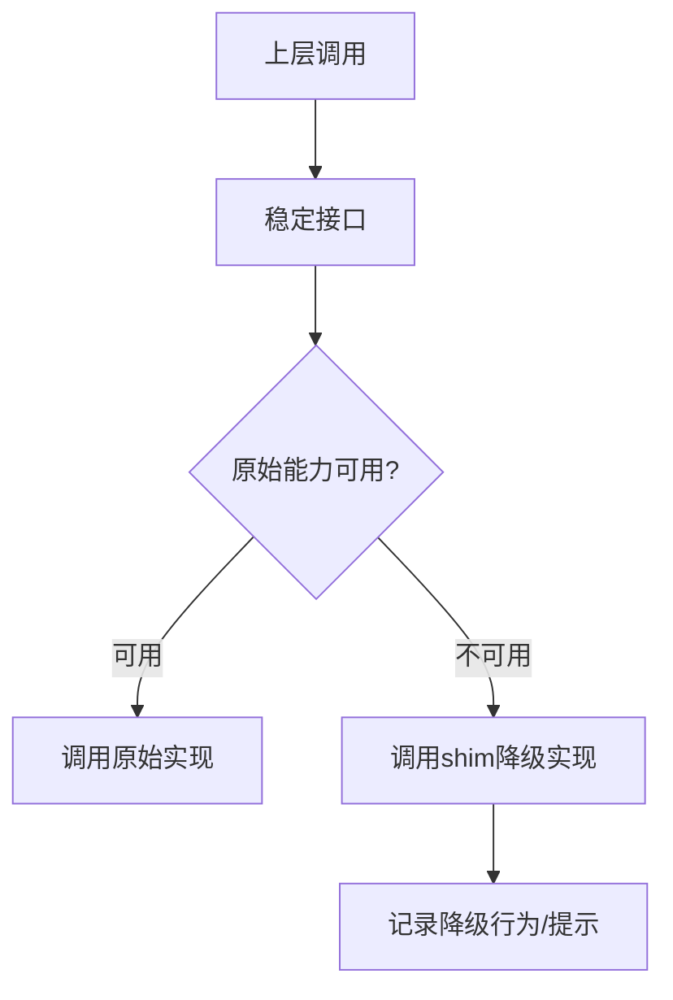

# 兼容与恢复模块设计

## 1. 模块定位

兼容与恢复模块用于承接“不可完整恢复”的能力空缺，保证项目在恢复工程背景下仍可安装、运行、演进。

主要覆盖：

- `shims/*`
- `vendor/*`

---

## 2. 职责边界

**负责**

- 为缺失私有模块或原生模块提供兼容实现
- 维持调用接口稳定，减少上层改动
- 在降级路径下提供可解释行为

**不负责**

- 替代完整上游业务能力
- 长期承载核心功能演进

---

## 3. 兼容层设计思路

---

## 4. 关键设计

## 4.1 接口优先

- 兼容层优先保证接口契约不破坏；
- 上层尽量不感知具体实现差异。

## 4.2 降级可解释

- 降级结果应明确说明能力限制；
- 避免“静默失败”导致误判。

## 4.3 可替换性

- shim 设计应便于后续替换为正式实现；
- 尽量隔离在边缘层，避免侵入核心流程。

---

## 5. 风险与治理

- **长期技术债风险**  
  建议：建立 shim 替换优先级路线图

- **行为偏差风险**  
  建议：对外明确“恢复实现与上游差异”清单

- **兼容层扩散风险**  
  建议：控制 shim 边界，不向核心层蔓延

---

## 6. 学习建议

- 练习 1：列出当前 shim 覆盖能力与风险级别
- 练习 2：设计一个 shim 替换为正式实现的迁移计划
- 练习 3：总结“何时应新增 shim，何时应重构上游调用”

