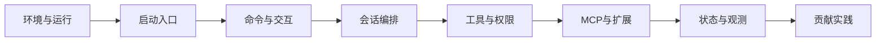

# Claude Code Rev 开源项目学习路线图

## 1. 学习目标

从“能跑起来”到“能读核心链路”再到“能独立贡献”的渐进式学习路线。

---

## 2. 路线总览

---

## 3. 分阶段安排

### 阶段0：环境与运行（0.5~1天）
- 目标：跑通项目、理解恢复工程背景
- 产出：本地启动手册与常见报错清单

### 阶段1：启动入口（1~2天）
- 目标：理解参数分流与主流程加载
- 产出：启动分流图

### 阶段2：命令与交互（1~2天）
- 目标：理解意图到执行的入口路径
- 产出：命令分类图与交互链路图

### 阶段3：会话编排（2~3天）
- 目标：掌握 QueryEngine 闭环
- 产出：单轮时序图与状态变更图

### 阶段4：工具与权限（2~3天）
- 目标：掌握工具池装配与安全控制
- 产出：工具装配流程图与权限策略表

### 阶段5：MCP 与扩展（2~3天）
- 目标：理解外部能力接入与生态扩展
- 产出：MCP 调用链图与插件技能生命周期图

### 阶段6：状态与观测（2天）
- 目标：建立稳定性与排障能力
- 产出：关键指标清单与排障 SOP

### 阶段7：贡献实践（持续）
- 目标：完成中等复杂度改动
- 产出：设计说明 + 验证清单 + PR

