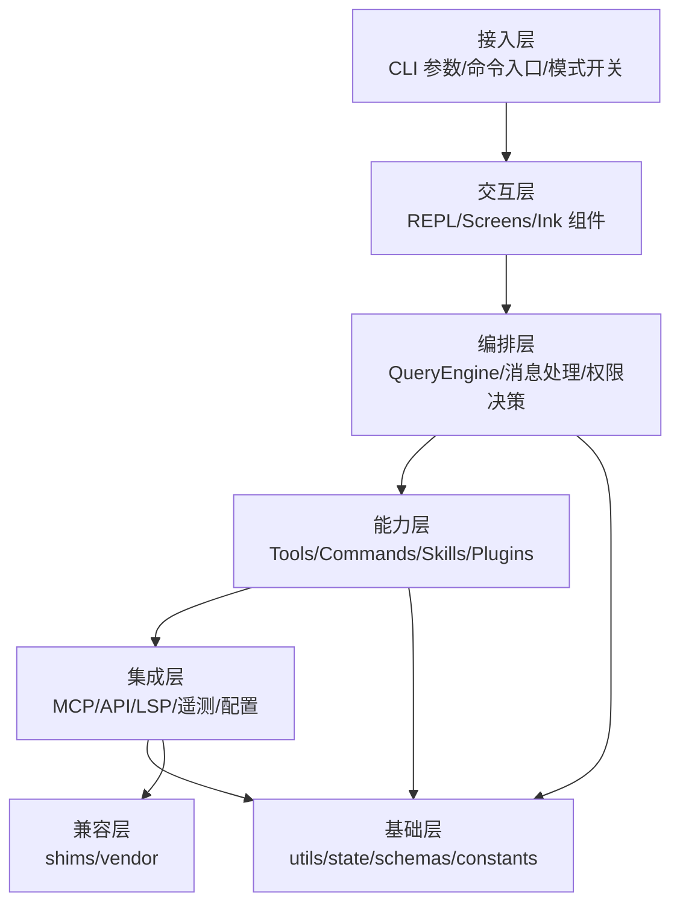
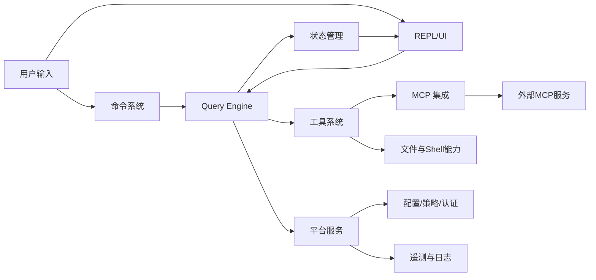

# Claude Code Rev 模块化技术设计报告

## 1. 文档目标与边界

本报告从工程化视角对项目进行模块化拆解，面向以下目标：

- 为新成员提供清晰的系统认知路径（先看模块，再看协作关系）。
- 统一模块职责边界，降低后续扩展与维护成本。
- 给重构、性能治理、稳定性治理提供架构基线。

范围说明：

- 聚焦 `src/` 主体架构，以及 `shims/`、`vendor/` 的补位角色。
- 不展开具体实现代码与函数细节，仅描述职责、输入输出、依赖关系。
- 输出内容偏“技术设计说明”，不是“使用手册”。

---

## 2. 项目总体定位

这是一个重建后的 CLI/TUI 智能体系统，核心特征如下：

- **交互形态**：命令行 + 终端 UI（React + Ink）。
- **系统形态**：单体应用主干 + 插件化扩展 + MCP 外部能力接入。
- **能力形态**：会话驱动（Query Engine）+ 工具调用（Tool Pool）+ 命令分发（Slash Commands）。
- **工程形态**：恢复工程，部分模块由 shim 兼容实现。

---

## 3. 模块分层设计

---

## 4. 关键模块说明（按功能分组）

## 4.1 启动与入口模块

**模块范围**

- `src/bootstrap-entry.ts`
- `src/entrypoints/cli.tsx`
- `src/main.tsx`

**职责**

- 处理最早期启动动作（宏初始化、基础异常处理）。
- 根据参数与特性开关进行“快速路径分流”（例如版本输出、守护进程、后台会话等）。
- 进入完整主流程时装配运行上下文（配置、认证、状态、插件、MCP、命令和工具池）。

**设计特点**

- 大量采用动态加载，降低冷启动成本。
- 快速路径与完整路径分离，兼顾性能与能力完整性。
- 顶层入口承担“调度”而非“业务实现”，保持层次清晰。

---

## 4.2 命令系统模块

**模块范围**

- `src/commands.ts`
- `src/commands/*`

**职责**

- 统一注册内置命令、动态命令（技能命令/插件命令）与特性门控命令。
- 把用户意图映射为命令执行上下文（提示型命令、动作型命令、会话型命令）。

**设计特点**

- 采用“注册清单 + 条件启用”的可扩展模式。
- 命令是用户操作语义的第一层抽象，屏蔽底层服务复杂度。
- 支持动态注入（技能、插件），具备生态扩展能力。

---

## 4.3 工具系统模块

**模块范围**

- `src/tools.ts`
- `src/tools/*`
- `src/Tool.ts`

**职责**

- 维护内置工具池（文件、Shell、Web、任务、MCP 等）。
- 根据权限与模式动态过滤可见工具。
- 合并内置工具与 MCP 工具，形成统一可调用工具集合。

**设计特点**

- 工具注册集中管理，便于审计与治理。
- 特性开关、运行模式、权限上下文共同决定可用工具面。
- 对模型暴露的是“稳定工具接口”，底层实现可替换。

---

## 4.4 会话与查询编排模块

**模块范围**

- `src/QueryEngine.ts`
- `src/query.ts`
- `src/utils/processUserInput/*`
- `src/utils/queryContext.ts`

**职责**

- 管理多轮会话状态（消息历史、使用量、权限拒绝、文件状态快照等）。
- 驱动“用户输入 -> 模型响应 -> 工具调用 -> 结果回写”的核心闭环。
- 承担会话级可靠性机制（中断控制、重试分类、持久化记录）。

**设计特点**

- Query Engine 是系统核心编排中枢。
- 会话状态与 UI 状态分层，支持 headless/SDK 与 REPL 场景并存。
- 通过抽象上下文对象实现策略可插拔（权限、提示词拼装、模式行为）。

---

## 4.5 状态管理与上下文模块

**模块范围**

- `src/state/*`
- `src/context/*`
- `src/hooks/*`

**职责**

- 维护应用级状态（工具权限、MCP 连接、任务、插件、远程状态等）。
- 以轻量 Store 机制驱动 UI 与业务状态联动。
- 提供跨模块共享的运行上下文（用户态、系统态、会话态）。

**设计特点**

- 无 Redux/Zustand，采用定制化轻量状态管理。
- 状态模型覆盖面广，兼顾交互态与系统态。
- 通过类型约束降低状态漂移与并发更新风险。

---

## 4.6 MCP 集成模块

**模块范围**

- `src/services/mcp/*`
- `src/tools/MCPTool/*`
- `src/tools/ListMcpResourcesTool/*`
- `src/tools/ReadMcpResourceTool/*`

**职责**

- 连接外部 MCP Server（stdio/sse/http/websocket 等传输）。
- 拉取并注册 MCP 工具、命令与资源。
- 处理认证、会话过期、错误分类、结果裁剪与落盘等治理能力。

**设计特点**

- 外部能力接入标准化，扩展成本低。
- 安全与可靠性机制完整（认证恢复、超时、错误隔离）。
- 与工具系统深度融合，形成统一调用体验。

---

## 4.7 插件与技能模块

**模块范围**

- `src/plugins/*`
- `src/skills/*`

**职责**

- 提供内置与动态扩展能力（命令、工具、技能提示等）。
- 管理插件加载、启停、错误记录与刷新机制。
- 结合技能系统增强任务理解与执行上下文。

**设计特点**

- 插件与技能是能力扩展主通道。
- 支持运行期加载与增量刷新，利于灰度与试验。
- 与命令、工具、会话编排形成闭环协同。

---

## 4.8 平台服务模块

**模块范围**

- `src/services/api/*`
- `src/services/analytics/*`
- `src/services/lsp/*`
- `src/services/policyLimits/*`
- `src/services/remoteManagedSettings/*`

**职责**

- 提供 API、策略、分析、LSP 等横向平台能力。
- 在主流程中提供“策略约束 + 可观测 + 远程配置”基础设施。

**设计特点**

- 以服务目录承载横切能力，弱化业务耦合。
- 与入口和编排层通过稳定接口交互，便于替换与裁剪。

---

## 4.9 兼容与恢复模块

**模块范围**

- `shims/*`
- `vendor/*`

**职责**

- 为缺失或无法恢复的模块提供兼容实现。
- 保证主系统在恢复工程条件下可运行、可扩展、可验证。

**设计特点**

- 明确“兼容层”边界，避免污染核心业务模块。
- 为后续替换为正式实现预留清晰迁移路径。

---

## 5. 模块协作关系图

---

## 6. 工程化评估（现状）

| 维度 | 现状评估 | 说明 |
|---|---|---|
| 分层清晰度 | 中高 | 目录边界清晰，但主模块体量偏大 |
| 可扩展性 | 高 | 命令/工具/MCP/插件均可扩展 |
| 可维护性 | 中 | `main.tsx` 过重，认知门槛较高 |
| 可观测性 | 中高 | 遥测与日志能力完整，需统一指标看板 |
| 可靠性 | 中高 | 有鉴权、重试、错误分流机制 |
| 性能可控性 | 中 | 已做快速路径和懒加载，仍有拆分空间 |

---

## 7. 设计风险与治理建议

1. **主入口聚合风险**  
   `main.tsx` 承载过多初始化逻辑，建议继续“入口瘦身”，拆分为启动编排器。

2. **特性开关复杂度风险**  
   多开关叠加易形成行为组合爆炸，建议建立“开关矩阵”和回归清单。

3. **MCP 外部依赖风险**  
   外部服务质量波动会传导到体验，建议按 server 维度增加熔断与降级策略。

4. **恢复工程长期演进风险**  
   shim 长期滞留会提高维护成本，建议建立替换优先级路线图（按业务影响排序）。

---

## 8. 建议的后续文档体系

- 《启动链路与模式分流设计》
- 《工具权限与安全控制设计》
- 《MCP 接入规范与故障处理手册》
- 《插件与技能扩展开发指南》
- 《会话状态模型与持久化策略说明》

---

## 9. 结论

该项目已具备“可运行、可扩展、可治理”的工程基础，核心优势在于：

- 入口快速分流机制成熟；
- 工具系统与 MCP 集成解耦良好；
- 会话编排能力统一、可跨场景复用。

后续重点应放在**主入口解耦、开关治理、外部依赖韧性提升**三条主线，以持续降低复杂度并提升演进效率。
