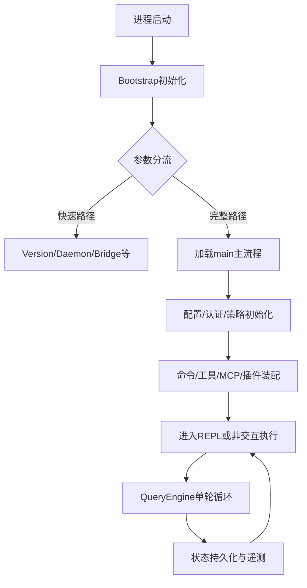
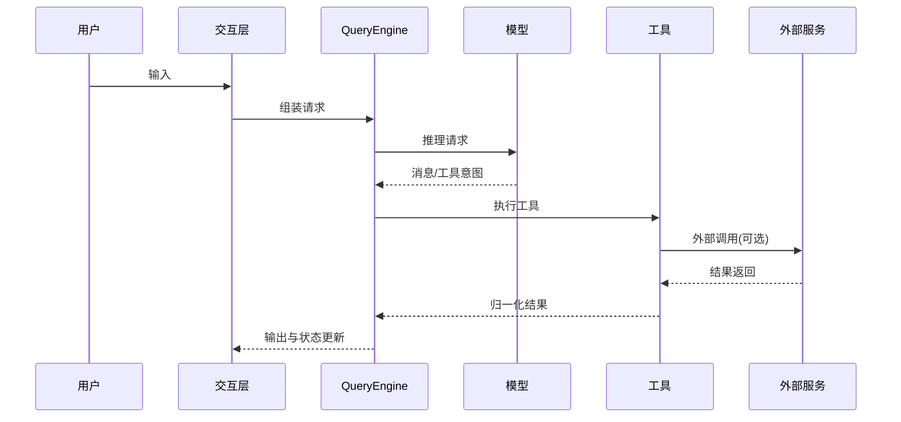

# Claude Code Rev 项目运行调度流程报告

## 1. 报告目标

从应用流程角度描述项目从启动到退出的端到端调度路径，帮助你理解运行时行为与问题定位路径。

---

## 2. 全局调度图

---

## 3. 启动调度

- 阶段 A：最小初始化（宏、异常处理）
- 阶段 B：CLI 参数识别与快速路径判定
- 阶段 C：未命中快速路径则加载主流程并完成能力装配

---

## 4. 主流程调度

---

## 5. 会话闭环调度

---

## 6. 异常与降级

- 认证异常：刷新或要求重新登录
- 权限拒绝：返回可解释原因
- 外部依赖失败：重试、降级或熔断
- 不可恢复错误：安全退出并记录

---

## 7. 调度优化建议

- 建立启动分流清单与最小依赖图
- 强化端到端调度指标（启动耗时、单轮时延、工具成功率）
- 建立故障定位 SOP（入口层 -> 编排层 -> 工具层 -> 外部层）

