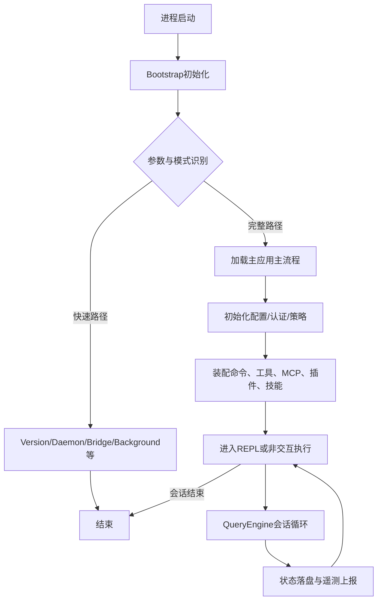
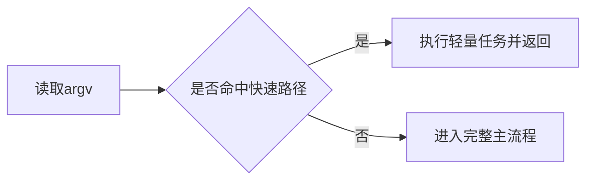
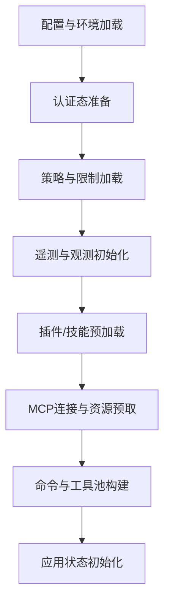
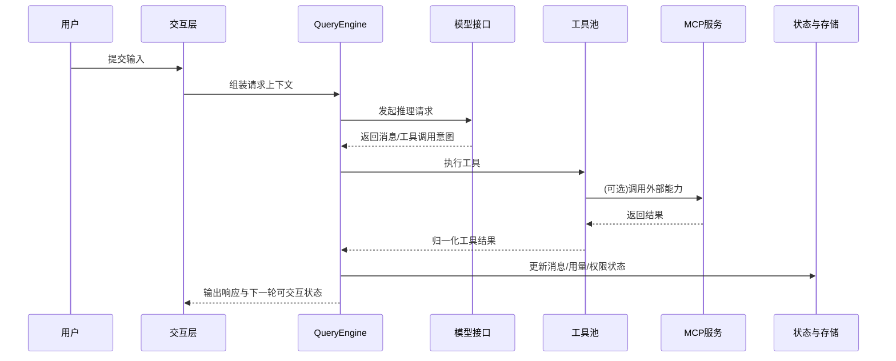
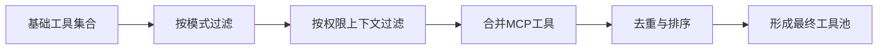
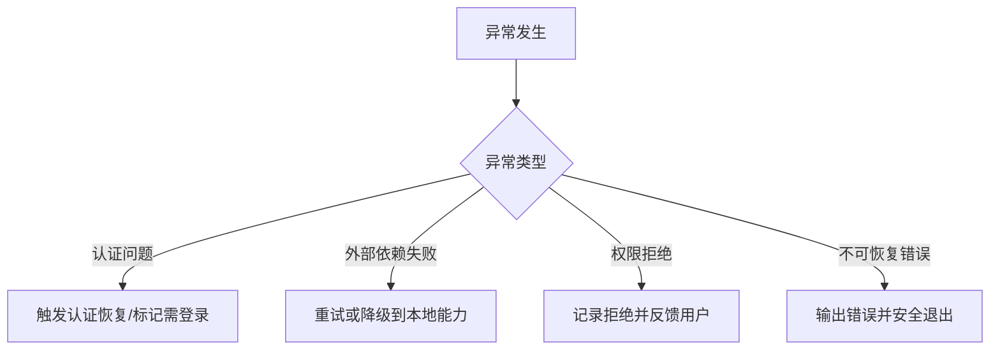

# Claude Code Rev 项目运行调度流程报告

## 1. 报告目标

本报告从“应用流程与运行调度”角度描述系统从启动到退出的全链路过程，重点说明：

- 启动阶段如何分流不同运行路径；
- 完整会话路径如何调度命令、模型、工具与外部服务；
- 运行期如何进行状态更新、异常处理与收尾。

本报告不包含具体代码，仅保留可执行层面的流程设计。

---

## 2. 全局运行态视图

---

## 3. 启动调度流程（Boot Orchestration）

### 3.1 阶段 A：Bootstrap 预处理

**输入**

- 进程参数、环境变量、运行平台上下文。

**核心动作**

- 注入构建期宏与关键环境变量；
- 注册基础输出/异常处理；
- 进入 CLI 入口调度器。

**产出**

- 具备可继续分流执行的最小可运行上下文。

---

### 3.2 阶段 B：CLI 快速路径判定

典型快速路径（按类别）：

- 信息类：版本输出、系统提示导出；
- 服务类：daemon worker、remote control、bridge；
- 会话管理类：后台会话查看/附着/终止；
- 扩展运行类：模板任务、runner 类子进程。

**设计价值**

- 降低非主路径时延；
- 避免不必要的大模块装载；
- 保持 CLI 响应一致性。

---

### 3.3 阶段 C：主流程加载

当未命中快速路径时，进入完整流程：

1. 启动早期输入捕获；
2. 动态加载主模块；
3. 进入 `main` 主调度。

---

## 4. 主流程调度（Main Runtime Orchestration）

## 4.1 初始化子阶段

**说明**

- 初始化过程同时处理“可用能力构建”和“安全边界构建”。
- 工具与命令在此阶段完成首轮过滤（权限、模式、特性开关）。

---

## 4.2 交互子阶段（REPL/非交互）

系统进入两类执行形态：

- **交互模式**：持续读取用户输入，循环驱动会话。
- **非交互模式**：一次性执行并返回结果。

无论哪种形态，核心都进入 Query Engine 的统一调度模型。

---

## 5. Query Engine 会话调度闭环

### 5.1 单轮调度关键步骤

1. 接收输入并构建系统上下文（命令、工具、权限、模型参数）。
2. 调用模型，解析是否需要工具执行。
3. 执行工具并处理结果（成功、拒绝、失败、重试）。
4. 回写消息与统计状态（token、耗时、成本、会话记录）。
5. 输出可展示结果并进入下一轮/结束。

### 5.2 调度特性

- **可中断**：支持中断控制器，避免长任务失控。
- **可持续**：会话状态跨轮次持久。
- **可治理**：权限拒绝、错误分类、预算限制可被统一管理。

---

## 6. 工具与外部能力调度

## 6.1 工具池装配流程

## 6.2 MCP 调度要点

- 支持多传输协议接入；
- 支持认证刷新与会话过期处理；
- 支持资源读取、工具调用、错误归一化；
- 支持输出裁剪与大结果持久化策略。

---

## 7. 状态流与数据流

## 7.1 主要状态对象

- 会话消息状态；
- 工具权限上下文；
- MCP 客户端与资源状态；
- 插件与技能状态；
- 任务与后台运行状态；
- 遥测与统计状态。

## 7.2 状态更新原则

- 单轮更新局部化，跨轮保持一致性；
- UI 展示态与编排态分离；
- 持久化与实时态并行，保证恢复能力与交互性能。

---

## 8. 异常处理与降级流程

设计目标：

- 错误可解释；
- 会话可继续（尽量）；
- 状态不污染；
- 用户可感知下一步操作建议。

---

## 9. 退出与收尾调度

会话结束时执行统一收尾动作：

- 刷新并落盘会话记录；
- 完成必要遥测和统计提交；
- 关闭外部连接与子进程资源；
- 进行安全退出。

---

## 10. 运行调度评估与优化建议

| 维度 | 当前表现 | 优化方向 |
|---|---|---|
| 启动效率 | 较好 | 继续细化快速路径和懒加载颗粒度 |
| 调度一致性 | 高 | 统一补充场景化调度状态图 |
| 扩展性 | 高 | 增强插件/MCP并发治理策略 |
| 稳定性 | 中高 | 强化外部依赖熔断与恢复演练 |
| 可观测性 | 中高 | 建立启动到会话结束的一体化指标链路 |

---

## 11. 总结

该项目的运行调度模型可以概括为：

- **启动分流快**：参数驱动的快速路径降低冷启动与非主流程成本；
- **主流程装配全**：配置、权限、插件、MCP、工具池统一构建；
- **会话闭环稳**：Query Engine 统一编排多轮交互与工具执行；
- **异常治理清**：认证、权限、外部依赖和不可恢复错误各有处理路径。

整体架构已具备工程化应用所需的可扩展调度骨架，后续可围绕“可观测、可恢复、可演进”持续深化。
